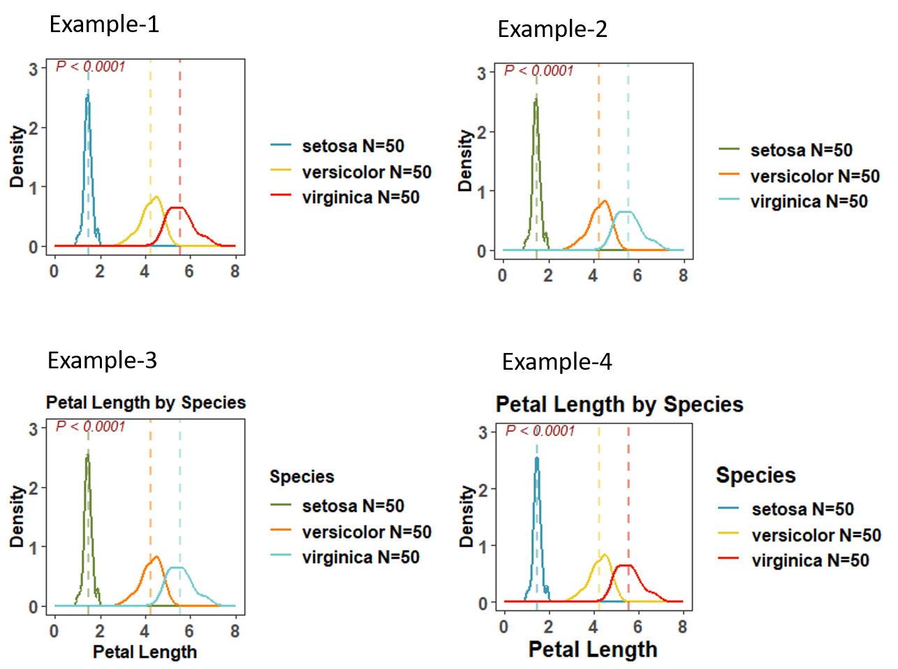

# R

This folder contains my R codes to do modeling and data visualization.

You can simply use source_url from package devtools. 
``` R
library(devtools)
source_url("https://raw.githubusercontent.com/Wei-Kuang/R/main/filename.R")
```

 
