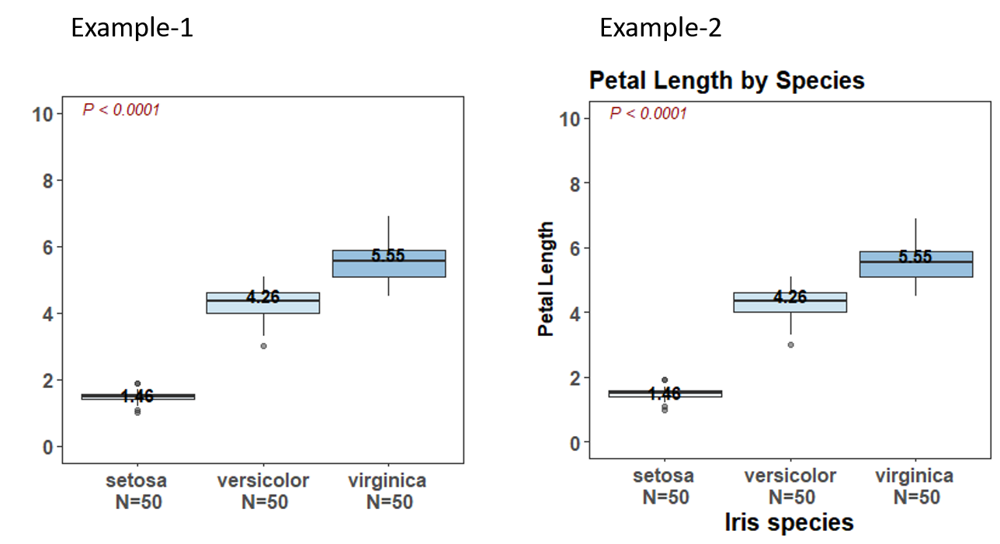

# Boxplot

**Plotting functions**
- f_boxplot

You can simply use source_url from package devtools. 
``` R
library('devtools')
source_url("https://raw.githubusercontent.com/Wei-Kuang/R/main/Plot_BoxDensity.R")
```

## f_boxplot

 

```R
#### Load iris data from ggplot2 package
library(ggplot2)
head(iris)
DF = iris
str(DF) # Note: Species is already a factor. 
table(DF$Species) 


#### Analysis Plan
# Purpose: We want to see the distribution of Petal.Length by Species
# Outcome: Petal.Length
# Grouping variable: Species with 3 categories

#### Note: For this boxplot function, the color is fixed at gradient blue.

#### Example-1 with a default setting
result = f_boxplot(df_input = DF,
          cont.var='Petal.Length', 
          cate.var='Species', 
          title.arg = '', 
          xlab.arg='',
          ylab.arg='',
          y.limit.arg = c(0,10), y.breaks.arg = seq(0,10,2)
          )

#### Example-2 with the user's ggplot theme and annotated layers
my_theme = theme(
  # hjust = 0.5 : Center of the title
  plot.title = element_text(size=15, face="bold"), 
  axis.title.x = element_text(size =15, face="bold"),
  axis.text.x = element_text(size = 12, face="bold"),
  axis.title.y = element_text(size =12,face="bold"),
  axis.text.y = element_text(size = 12,face="bold"),
  legend.title = element_text(size = 15, face = "bold" ),   
  legend.text = element_text(size = 12, face = "bold"),
  # Adjust facet
  strip.text.x = element_text(size = 12, face = "bold")
)


result = f_boxplot(df_input = DF,
          cont.var='Petal.Length', 
          cate.var='Species', 
          title.arg = 'Petal Length by Species', 
          xlab.arg='Iris species',
          ylab.arg='Petal Length',
          y.limit.arg = c(0,10), y.breaks.arg = seq(0,10,2),
          theme.arg = my_theme
          )

result
#   Species     Mean Median    SD     N N_Label            
#   <fct>      <dbl>  <dbl> <dbl> <int> <chr>              
# 1 setosa      1.46   1.5  0.174    50 "setosa\n N=50"    
# 2 versicolor  4.26   4.35 0.470    50 "versicolor\n N=50"
# 3 virginica   5.55   5.55 0.552    50 "virginica\n N=50"
```
