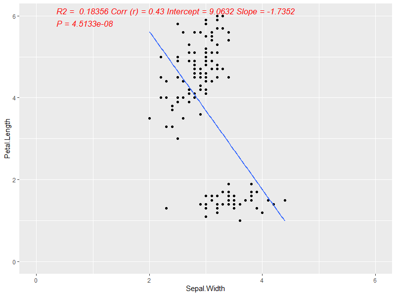

# Regression

**modeling functions**
- f_scatter_plot (This is the simple regression.)
- f_linear_model (This is more general - multiple regression)
- f_size_lm (Researchers like to check the sample size for subgroup)

You can simply use source_url from package devtools. 
``` R
library('devtools')
source_url("https://raw.githubusercontent.com/Wei-Kuang/R/main/LinearRegression.R")
```

#### Example of simple regression and scatterplot
 
```
library(datasets)
data(iris)
summary(iris)

f_scatter_plot(input_data =iris, 
                var_x.arg= 'Sepal.Width', 
                var_y.arg ='Petal.Length',  
                x.limit.arg = c(0,10), x.breaks.arg =seq(0,10,2),
                y.limit.arg = c(0,10), y.breaks.arg =seq(0,10,2))
```

#### Example of multiple regression
```
library(datasets)
data(iris)
summary(iris)

# Setting
df_input= iris
var_outcome = 'Sepal.Length'
var_x = 'Species' # This is the empty place for the variable that we want to investigate

var_covar = c('Sepal.Width', 'Petal.Length') # These are the covariates

# Get Model
mymodel = f_linear_model(df_input.arg=df_input,
                         var_outcome.arg = var_outcome, 
                         var_x.arg = var_x, 
                         var_covar.arg = var_covar)
# Get N 
N_df = f_size_lm(model.arg = mymodel, var_outcome.arg = var_outcome )
N_df

# Get the Coef
Coef_df =  moderndive::get_regression_table(mymodel,digits=8) %>%
  mutate( CI95 = paste0( round(lower_ci,2),' - ',round(upper_ci,2) ) ) %>%
  dplyr::select( - c(lower_ci, upper_ci))


Report_df = full_join(x =N_df ,y=Coef_df, by= c('key'='term')) 


Report_df %>% select(-key)
#      Variable     Levels   N   estimate  std_error statistic  p_value          CI95
#1 Sepal.Length            150         NA         NA        NA       NA          <NA>
#2      Species     setosa  50         NA         NA        NA       NA          <NA>
#3      Species versicolor  50 -0.9558123 0.21519853 -4.441537 1.76e-05 -1.38 - -0.53
#4      Species  virginica  50 -1.3940979 0.28566053 -4.880261 2.76e-06 -1.96 - -0.83
#5  Sepal.Width            150  0.4322172 0.08138982  5.310458 4.00e-07   0.27 - 0.59
#6 Petal.Length            150  0.7756295 0.06424566 12.072869 0.00e+00    0.65 - 0.9
#7         <NA>       <NA>  NA  2.3903891 0.26226815  9.114294 0.00e+00   1.87 - 2.91

# Model quality
get_regression_summaries(mymodel)

#  r_squared adj_r_squared    mse  rmse sigma statistic p_value    df  nobs
#      <dbl>         <dbl>  <dbl> <dbl> <dbl>     <dbl>   <dbl> <dbl> <dbl>
#1     0.863          0.86 0.0931 0.305  0.31      229.       0     4   150
```
